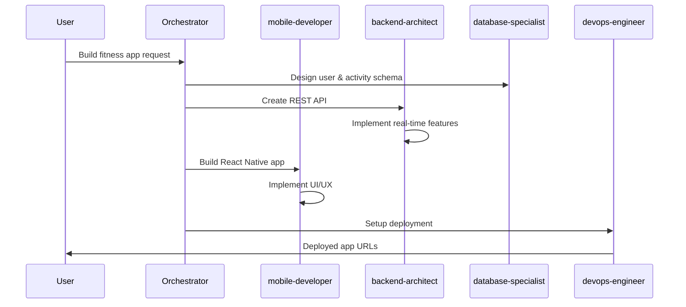

# Multi-Agent Workflow Examples

## Example 1: Building a Full-Stack E-Commerce Platform

### Initial Request
```
@orchestrator Build a complete e-commerce platform with user authentication, 
product catalog, shopping cart, and payment integration using React and Node.js
```

### Orchestrator's Delegation Plan

```markdown
Phase 1: Planning & Design
├── @product-strategist → Define requirements and user stories
├── @ux-designer → Create wireframes and user flows
└── @database-specialist → Design database schema

Phase 2: Backend Development (Parallel)
├── @backend-architect → Design API architecture
├── @database-specialist → Implement database
├── @python-pro → Build authentication service
└── @backend-architect → Create product catalog API

Phase 3: Frontend Development
├── @frontend-specialist → Build React components
├── @ux-designer → Review UI implementation
└── @frontend-specialist → Integrate with backend APIs

Phase 4: Payment & Security
├── @backend-architect → Integrate Stripe payment
├── @security-auditor → Security review
└── @test-engineer → Write integration tests

Phase 5: Deployment
├── @devops-engineer → Setup CI/CD pipeline
├── @cloud-architect → Configure AWS infrastructure
└── @devops-engineer → Deploy to production
```

## Example 2: AI-Powered Analytics Dashboard

### Request
```
@orchestrator Create an AI-powered analytics dashboard that processes 
real-time data streams and provides predictive insights
```

### Execution Flow

1. **Data Pipeline Setup**
   ```
   @data-engineer Design and implement real-time data ingestion pipeline 
   using Kafka and Spark Streaming
   ```

2. **AI Model Development**
   ```
   @ai-engineer Develop predictive models for time-series forecasting 
   and anomaly detection
   ```

3. **Dashboard Implementation**
   ```
   @frontend-specialist Build interactive dashboard with React and D3.js 
   for data visualization
   ```

4. **Integration & Testing**
   ```
   @fullstack-engineer Integrate all components and implement WebSocket 
   connections for real-time updates
   ```

## Example 3: Mobile App with Backend

### Request
```
Build a social fitness tracking app for iOS and Android with real-time 
features and social sharing
```

### Agent Coordination



## Example 4: Code Review Pipeline

### Simple Review Request
```
@code-reviewer Please review this Python module for best practices and security
```

### Comprehensive Review Pipeline
```
@orchestrator Perform comprehensive code review including security, 
performance, and testing coverage
```

**Orchestrator delegates to:**
1. `@code-reviewer` - General code quality
2. `@security-auditor` - Security vulnerabilities
3. `@test-engineer` - Test coverage analysis
4. `@python-pro` - Python-specific optimizations

## Example 5: Blockchain DApp Development

### Request
```
@blockchain-developer Create a decentralized voting system smart contract 
with frontend interface
```

### Multi-Agent Approach
```
Phase 1: @blockchain-developer writes smart contract
Phase 2: @security-auditor audits contract for vulnerabilities
Phase 3: @frontend-specialist builds Web3 interface
Phase 4: @test-engineer writes contract tests
Phase 5: @devops-engineer deploys to testnet
```

## Example 6: Data Pipeline with ML

### Complex Data Science Project
```
@orchestrator Build an ML pipeline that processes customer data, 
trains a recommendation model, and serves predictions via API
```

### Execution Steps

1. **Data Engineering**
   ```python
   # @data-engineer creates ETL pipeline
   def create_feature_pipeline():
       return Pipeline([
           ('extract', DataExtractor()),
           ('transform', FeatureEngineering()),
           ('load', DataWarehouseLoader())
       ])
   ```

2. **ML Development**
   ```python
   # @ai-engineer builds recommendation model
   class RecommendationModel:
       def train(self, features):
           # Model training logic
           pass
   ```

3. **API Development**
   ```python
   # @backend-architect creates prediction API
   @app.route('/predict', methods=['POST'])
   def predict():
       # Serve predictions
       pass
   ```

## Tips for Effective Multi-Agent Use

### 1. Clear Task Definition
Be specific about requirements to help the orchestrator create an optimal plan.

### 2. Leverage Parallel Execution
Identify independent tasks that can be executed simultaneously.

### 3. Chain Dependent Tasks
Ensure proper sequencing for tasks with dependencies.

### 4. Use Specialized Agents
Choose the most appropriate agent for each specific task.

### 5. Review and Iterate
Use review agents to validate work before deployment.

## Common Patterns

### Pattern 1: Design → Implement → Test → Deploy
```
@ux-designer → @frontend-specialist → @test-engineer → @devops-engineer
```

### Pattern 2: Parallel Development
```
Parallel:
├── @backend-architect (API)
├── @frontend-specialist (UI)
└── @mobile-developer (App)
```

### Pattern 3: Security-First Development
```
@security-auditor (threat model) → @backend-architect (secure implementation) → @security-auditor (final audit)
```

### Pattern 4: Data-Driven Features
```
@data-engineer (pipeline) → @ai-engineer (model) → @backend-architect (API) → @frontend-specialist (UI)
```